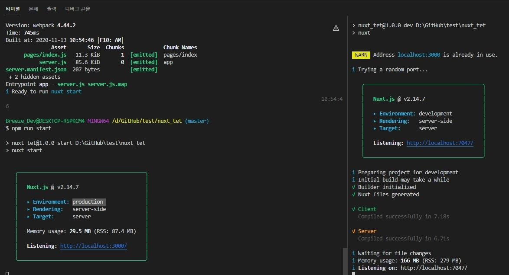

# Nuxt.js?
Nuxt.js는 Vue.js 프레임워크를 기반으로 SSR(Server Side Rendering) 웹 페이지를 만들 수 있도록 해 주는 라이브러리입니다.    
SEO 등의 문제로 CSR이 아닌 SSR 웹을 구축해야 하는 경우에 유용하게 사용할 수 있습니다.           

### Nuxt.js 설치
설치하는 방법은 크게 [3가지 방법](https://uxgjs.tistory.com/146)이 있습니다.   
1. 수동으로 설치하는 방법
2. vue-cli로 설치로 설치하는 방법
3. npm(yarn)으로 설치하는 방법
```
$ npx create-nuxt-app nuxt_app
$ yarn create-nuxt-app nuxt_app
```
   
참고 : [프로젝트 설정 방법](https://velog.io/@brviolet/Nuxt.js-%EC%8B%9C%EC%9E%91%ED%95%98%EA%B8%B0-1.-%EC%84%A4%EC%B9%98)   

### Nuxt.js 실행
해당 폴더(nuxt_app)로 이동후 실행 합니다.
개발용   
```
$ npm run dev
$ yarn run dev
```
배포용   
```
$ npm run build
$ npm start
$ yarn run build
$ yarn start
```


### 구조적 차이
   


* 넉스트(Nuxt)?     
Nuxt.js는 Vue.js 프레임워크를 기반으로 [SSR(Server Side Rendering)](https://yamoo9.gitbook.io/vue-a11y-seo/seo#ssr) 웹 페이지를 만들 수 있도록 해 주는 라이브러리입니다.     
검색엔진 최적화(SEO)등의 문제로 CSR(Client Side Rendering)이 아닌 SSR(Server Side Rendering) 웹을 구축해야 하는 경우에 사용할 수 있습니다.  
참고 : [SSR & CSR비교](https://yunzema.tistory.com/103)   


참고 : [서버 구성 가이드](https://router.vuejs.org/guide/essentials/history-mode.html#example-server-configurations)
https://blog.naver.com/skykbc/222131031577   
https://vue-nuxt.gitbook.io/nuxt/installation
https://ko.nuxtjs.org/docs/2.x/get-started/installation/
https://velog.io/@bluestragglr/Nuxt.js-vs-Vue.js-SSR-%EC%8B%9C%EC%9E%91%ED%95%98%EA%B8%B0#%EB%B0%94%EC%81%9C-%ED%98%84%EB%8C%80%EC%9D%B8%EC%9D%84-%EC%9C%84%ED%95%9C-%EC%9A%94%EC%95%BD
https://velog.io/@brviolet/Nuxt.js-%EC%8B%9C%EC%9E%91%ED%95%98%EA%B8%B0-1.-%EC%84%A4%EC%B9%98
https://uxgjs.tistory.com/146
https://joshua1988.github.io/vue-camp/vue/axios.html#%EC%95%A1%EC%8B%9C%EC%98%A4%EC%8A%A4-%EC%84%A4%EC%B9%98
